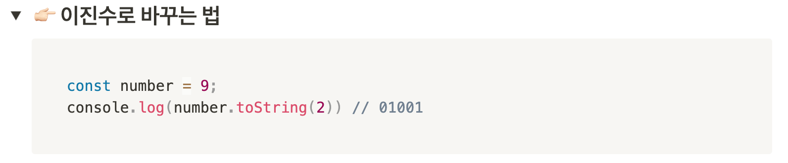

# 1월 2번째 주 WIL

# ✏️ 1.2 **Sun.**

- [x] 알고리즘 공부
      

  어제 오늘 계속해서 알고리즘을 풀고 있는데, 카카오톡 코딩 테스트 문제는 정말 어렵다 😭  코딩 테스트 공부도 해야되고 ... 면접 준비도 해야되고 ... 자바스크립트 개념공부도 해야되고 ... 진짜 몸뚱아리가 남아나지 않는다 ㅠㅠ 오늘 알고리즘 공부하면서 아주 새로운 method? 를 찾았다! toString() 메소드 안에 2라고 넣으면 2진수로 변환해주는 아주 슬기로운 메소드 발견!

---

# ✏️ 1.3 **Mon.**

- [x] 자바스크립트 스터디

항해가 시작 한 후부터 항해가 끝나고, 지금까지 한 번도 제대로 쉬어본 적이 없는 것 같다. 이제 취직 준비를 하면서 부족했던 개념을 공부하면서 프로젝트를 하던 때가 그립다. 개발자를 준비하면서 프로젝트를 하고, 문제가 생기면 문제를 해결해 가는 데에 희열이 있었는데, 개념 공부는 하면 할수록 끝이 없이 들어가니깐 지치는 면이 없지 않아 있는 것 같다. 하지만 자바스크립트의 개념이 중요한지 알기에 매일 열심히 하는 중 ㅠ 그래도 쉴 때는 좀 쉬어야 될 거 같은데, 4개월 동안 맘 편히 쉰 적이 없어서 지치는 것 같다! 그래도 오늘도 프로그래머스 한문제 풀고 자자!

---

# ✏️ 1.4 **Tues.**

- [x] 인터뷰 준비
- [x] 브라우저 동작 순서 공부

### 🚀  웹 브라우저 동작 순서

1. 웹 브라우저 → DNS 에게 호스트 IP주소 물어봄
2. DNS → IP 주소 줌
3. 웹 브라우저 → 해당 IP서버 찾아감
4. 웹 브라우저 → HTTP request 데이터 요청 → 서버
5. 서버 → HTTP response 데이터 줌 → 브라우저
6. 이제 데이터 받았으니깐, 사용자가 이해할수있도록 예쁘게 그려야겠다. (사용자에게 데이터 출력)
7. 출력 전 → 브라우저는 서버에서 받은 데이터 해석 해야함 Parsing
8. 브라우저의 렌더링 엔진은 HTML 파싱 → 돔 트리 생성
9. 렌더링 엔진이 스타일 태그를 만난다면 CSS 파싱 → CSSOM 트리 생성
10. 다시 HTML 돌아감
11. 렌더링 엔진이 스크립트 태그를 만난다면 → 자바스크립트 엔진에게 제어권을 준다
12. 자바스크립트 엔진 → 코드를 해석하여 ATM 트리를 만듬/ 실행
13. 다시 html 완료
14. 브라우저는 → dom + cssom = render tree 를 만든다 ⇒ 여기 까지가 construction 과정
15. 렌더링 엔진 → 렌더 트리의 요소들을 화면의 올바른 위치에 표시 ⇒ Layout과정
16. UI 백앤드 → 렌더 트리의 노드들을 돌면서 UI를 그린다 ⇒ paint
17. 노드들의 레이어를 순서대로 구성 ⇒ Composition ⇒ z-index낮은 요소 놓고 높은 요소를 놓는것
18. Layout - composition ⇒ opperation

---
